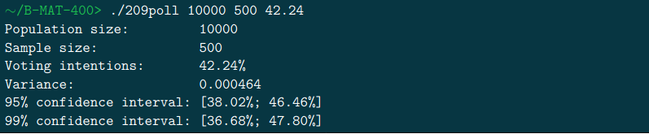

# 209poll

Several months before an important election, many polls seem to pop up from nowhere. Their interpretations are often surrounded by uncertainty: to what extent are these polls reliable? Why are there so many differences between poll institutes? And from day to day? Is a 3% variation significant? etc. . .

To estimate the accuracy of the results, a confidence interval is given. It is defined by the fact that there is a x% probability that this interval encompasses the true value.

You already know that questioning people follows a Bernoulli process, and therefore that a binomial distribution (converging toward a normal distribution) is a good model for the results. You can then easily compute the confidence intervals, knowing that:
- the 95% confidence interval amplitude is 2 ×1.96√v
- the 99% confidence interval amplitude is 2 ×2.58√v

where v stands for the variance of the sample proportion (corrected for finite populations).

The goal of this project is to compute the 95% and 99% confidence intervals.

## Compile

The project compile with *Makefile*:

For compile the project use the commande:

```console
foo@bar:~/209poll$ make re
```

For clean the project use:

```console
foo@bar:~/209poll$ make fclean
```

Get instruction with:


```console
foo@bar:~/209poll$ ./209poll -h
```


## Example


